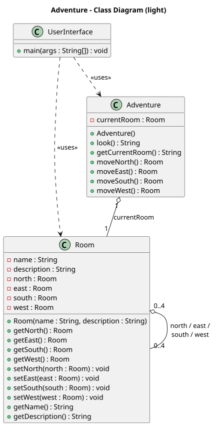
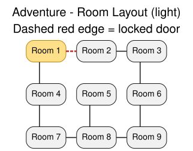
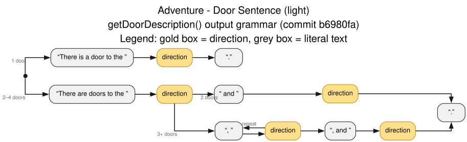

# Project: Adventure (Group 7)

Our implementation of the [course project assignment](https://github.com/EK-DAT-GBG-1SEM-E26AB/DAT-GBG-DA-E26AB/tree/main/projekter/adventure), based on the 1977 text adventure Colossal Cave Adventure by Willie Crowther.

For reference, the original game's [C source code](https://github.com/vattam/BSDGames/tree/master/adventure) is bundled with a Linux port of BSD Games.

## Build and run

```bash
mvn compile                           # Compile to bytecode
java -cp target/classes UserInterface # Run UserInterface.main
```

> [!TIP]
> `-cp target/classes` points Java at the compiled `.class`
> files produced by `mvn compile`.

## Diagrams

### Class diagram



### Room layout



### Door sentence

Railroad/syntax diagram of the output grammar of `Room.getDoorDescription()` as of [commit `b6980fa`](https://github.com/mwnDK1402/Adventure/commit/b6980fa92032ee8de6247d8488b51a6f2456069a).


