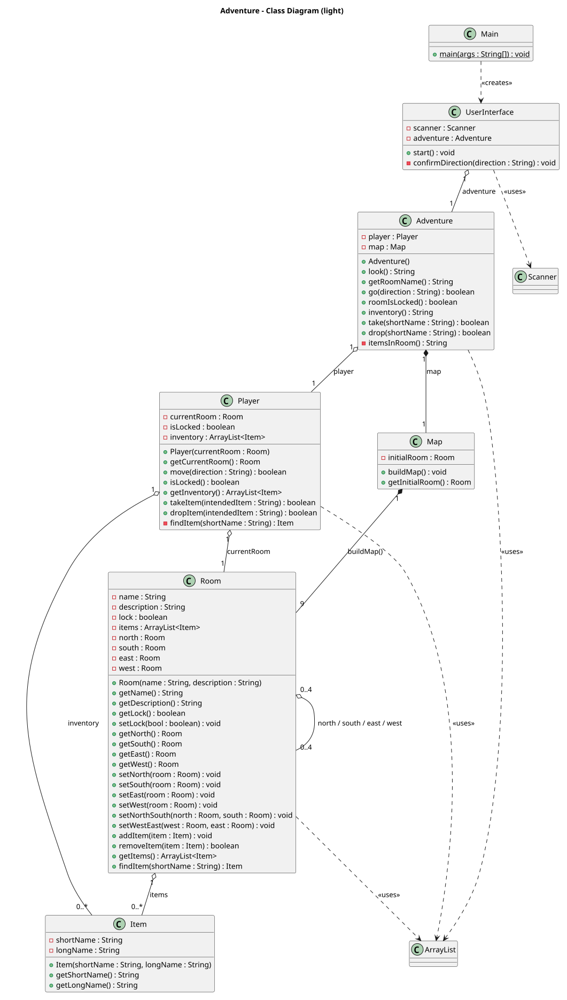
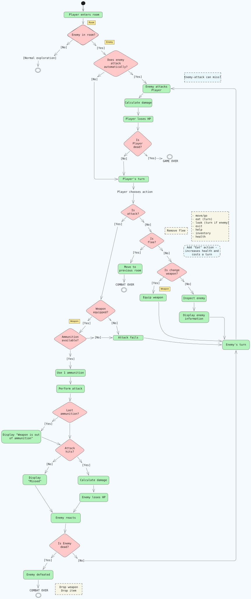
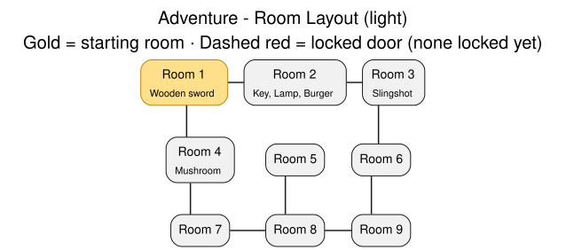

# Project: Adventure (Group 7)

Our implementation of the [course project assignment](https://github.com/EK-DAT-GBG-1SEM-E26AB/DAT-GBG-DA-E26AB/tree/main/projekter/adventure), based on the 1977 text adventure Colossal Cave Adventure by Willie Crowther.

For reference, the original game's [C source code](https://github.com/vattam/BSDGames/tree/master/adventure) is bundled with a Linux port of BSD Games.

## Contributors

| Name | GitHub |
| --- | --- |
| Mathias | [mwnDK1402](https://github.com/mwnDK1402) |
| Nikita | [NikitaM2527](https://github.com/NikitaM2527) |
| Nikolas | [NikolasCCT](https://github.com/NikolasCCT) |

## Commands

| Command | Aliases | Description |
| --- | --- | --- |
| `go north` | `north`, `n` | Move to the room to the north |
| `go south` | `south`, `s` | Move to the room to the south |
| `go east` | `east`, `e` | Move to the room to the east |
| `go west` | `west`, `w` | Move to the room to the west |
| `look` | | Describe the current room, its items and any enemies |
| `inventory` | | List the items you are carrying |
| `take <item>` | | Pick up an item from the current room |
| `drop <item>` | | Put down an item from your inventory |
| `eat <item>` | | Eat an item, either from the current room or from your inventory |
| `equip <weapon>` | | Equip a weapon from your current room or your inventory |
| `attack [enemy]` | | Attack with your equipped weapon; omit the enemy name to hit the first one here |
| `health` | | Show your current health and how you are feeling |
| `help` | | Show the list of commands |
| `exit` | | Quit the game |

## Diagrams

### Class diagram

### Activity diagram

{height=95%}

### Room layout

